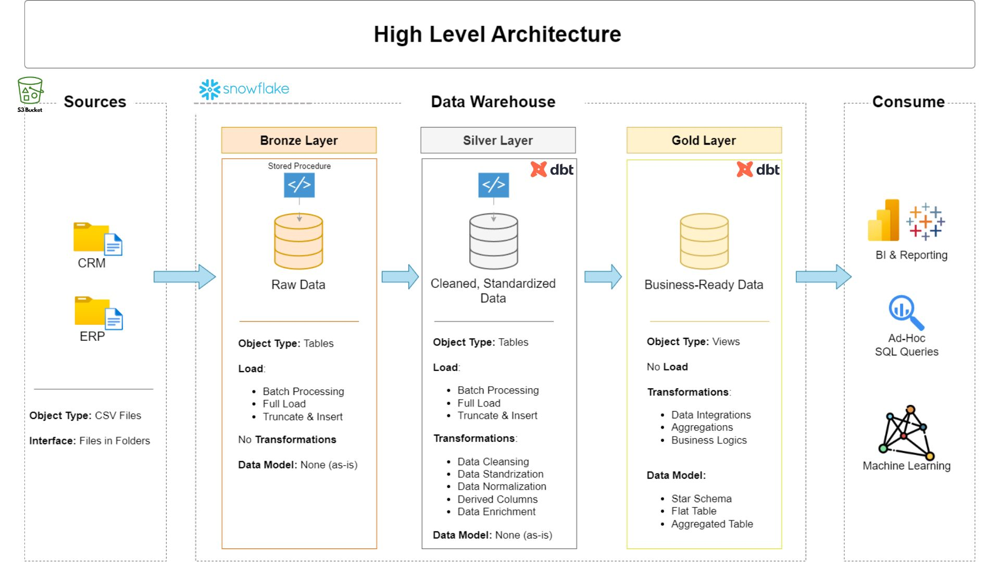
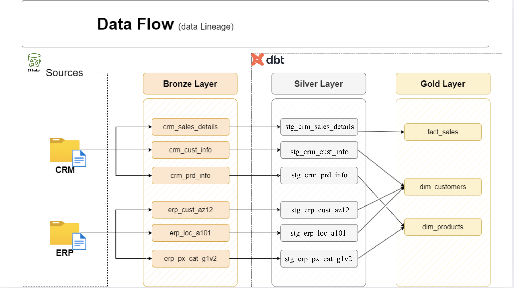
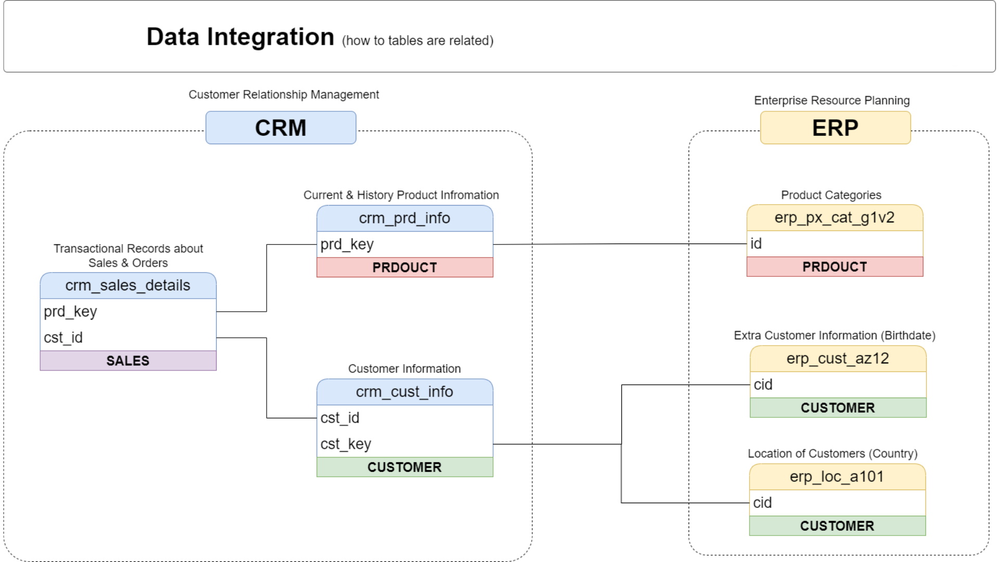

#  End-to-End Data Warehouse with DBT & Snowflake using Medallion Architecture  

This project is centered on designing a modern, scalable data pipeline that consolidates sales data from multiple sources. 

## 📑 Table of Contents  

1. [Project Overview](#-project-overview)  
2. [Inspiration](#-inspiration)  
3. [As-Is vs To-Be](#-as-is-vs-to-be)  
4. [Data Architecture](#-high-level-data-architecture--data-management-techniques-adopted)
   - [High-Level Design Architecture](#-high-level-data-architecture--data-management-techniques-adopted)
   - [Data Management Techniques](#-high-level-data-architecture--data-management-techniques-adopted)
5. [Data Transformation Layers](#️-data-transformation-layers)  
   - [Extraction](#️-data-transformation-layers)  
   - [Transformation](#️-data-transformation-layers)  
   - [Load](#️-data-transformation-layers)  
6. [Key Terminology](#-key-terminology)  
7. [Why DBT?](#️-why-dbt-over-raw-sql)  
8. [Project Setup and Requirements](#-project-setup-and-requirements)  
    - [Repository Structure](#-repository-structure)
    - [Load Raw Data into S3](#1-load-raw-data-into-s3)
    - [Snowflake Data Warehouse Setup](#2-snowflake-data-warehouse-setup)
    - [Data Flow (Data Lineage)](#3--data-flow-data-lineage)
    - [Data Integration](#4--data-integration-how-tables-are-related)
    - [DBT Models](#5-creating-dbt-models-bronze--staging)
9. [Usage](#-usage)  
10. [Future Improvements](#-future-improvements)  
11. [Conclusion](#-conclusion)  

## 📌 Project Overview  
This project demonstrates how to design, implement and transform a **modern, scalable data warehouse** by leveraging the **Medallion Architecture (Bronze, Silver, Gold layers)** with **Snowflake** as the data warehouse, **Amazon S3** as the data lake storage, and **DBT (Data Build Tool)** for transformation and orchestration.  

This solution follows an **ETL approach** that ingests raw data from an **Enterprise Resource Planning** (ERP) and **Customer Relationship Management** (CRM) source, stores it in an **S3 bucket**, and then pipelines it into **Snowflake** for transformation using Data Build Tool (DBT) and Visualization and Reportin using PowerBI Tool.  

By applying the **Medallion Architecture**, data flows through structured stages (Bronze → Silver → Gold), ensuring data quality, scalability, and analytical readiness.  

## 👉 **Inspiration:**  

This project was inspired by the YouTube content by *Data with Baraa* titled: [**“SQL Data Warehouse from Scratch | Full Hands-On Data Engineering Project”**](https://youtu.be/9GVqKuTVANE).

While the original project used raw SQL for data transformations, I decided to **recreate and enhance it using DBT** to take advantage of modern data engineering best practices.  

Unlike traditional raw SQL development, this project leverages **DBT** to manage transformations in a `modular`, `reusable`, and `version-controlled` way. 


## 🔍 As-Is vs To-Be  

### ❌ As-Is (Current Challenges)  
- The Data Warehouse is currently built on **SQL Server Express** with **SQL Server Management Studio (SSMS)** for database management and interaction.
- Data pipelines are **heavily dependent on raw SQL scripts** making them difficult to maintain and scale.
- Lack of **version control and collaboration** – SQL code is often scattered across scripts and environments.  
- **Data quality issues** due to limited testing and validation of transformations.  
- **Data lineage tracking is manual**, using external tools, which slows down reporting and reduces transparency.
- Manual and repetitive ETL processes that are **time-consuming** and prone to human error.  


### ✅ To-Be (Future State with Snowflake + dbt + Medallion Architecture)
- The data platform is built on **Snowflake**, providing **scalability, elasticity, and cost efficiency** for handling structured and semi-structured data.  
- **dbt (Data Build Tool)** is adopted for modular SQL-based transformations, enabling **clean, maintainable, and reusable code**.  
- All transformations follow the **Medallion Architecture (Bronze, Silver, Gold)** to ensure a clear separation of raw data, cleansed/validated data, and business-ready marts.  
- **Version control (Git)** ensures collaboration, code reviews, and proper change management across teams.  
- Built-in **dbt tests (generic + custom)** provide automated **data quality checks** (e.g., uniqueness, null handling, referential integrity).  
- **Automated data lineage** and documentation are generated directly from dbt, ensuring **end-to-end visibility** of data flows.  
- ETL processes are **automated and orchestrated** (via dbt Cloud, Airflow, or similar), reducing manual effort and human error.  
- Enables faster **time-to-insight** with reliable, trusted data that supports analytics, dashboards, and reporting.  


## 📊 High Level Data Architecture & Data Management Techniques Adopted  

The data architecture for this project follows Medallion Architecture **Bronze**, **Silver**, and **Gold** layers:

1. **Bronze Layer**: Stores raw data as-is from the source systems. Data is ingested from S3 bucket into Snowflake.
2. **Silver Layer**: This layer includes data cleansing, standardization, and normalization processes to prepare data for analysis.
3. **Gold Layer**: Houses business-ready data modeled into a star schema required for reporting and analytics.



To ensure clean, reliable, and business-ready data, the following **data management techniques** were applied in this project:  

### 🔹 Extraction  
- Descriptions
    - Files from ERP and CRM systems are first landed in an **Amazon S3 bucket**.  
    - Using **Snowflake external stages**, the data is read directly from S3 and loaded into the **Bronze layer tables**.  
- Methods
    - **Extraction Methods: Pull extraction** – Data is pulled directly from source systems into the pipeline at scheduled intervals.  
    - **Extract Type: Full extraction** – Each run retrieves the complete dataset rather than incremental changes, ensuring consistency with the source.  
    - **Techniques: File Parsing / S3** – Raw files (CSV/JSON/Parquet) from ERP and CRM sources are parsed and ingested into **Amazon S3** before loading into Snowflake.  

### 🔹 Transformation 
- Descriptions 
    - The transformation layer ensures raw data is standardized, cleaned, and enriched for business use.  
    - DBT models apply **cleaning, deduplication, standardization, and aggregations**.  
    - Jinja templates, macros, and DBT testing ensure accuracy and maintainability. 
- Methods
    - **Data Enrichment & Integration** – Combine ERP and CRM data to provide a holistic view of sales activities.  
    - **Derived Columns** – Create additional fields (e.g., revenue = price × quantity) for analysis.  
    - **Data Normalization** – Apply consistent naming conventions, units, and formats across datasets.  
    - **Data Aggregation** – Summarize data at various levels (customer, region, product).  
    - **Business Rules & Logic** – Implement KPIs and domain-specific transformations.  

    - **Data Cleaning Techniques:**  
        - **Remove duplicates** – Eliminate redundant records to ensure accuracy.  
        - **Data filtering** – Keep only relevant and valid data points.  
        - **Handle missing values** – Apply strategies like imputation or null handling.  
        - **Guard against invalid values** – Detect and correct incorrect data entries.  
        - **Handle unwanted spaces** – Trim unnecessary whitespace in textual data.  
        - **Data type casting** – Convert values into appropriate data types (e.g., string → integer).  
        - **Outlier detection** – Identify unusual values that may distort analysis. 

### 🔹 Load 
- Descriptions:
    - Transformed data in the Snowflake **Silver Layer** is loaded into the **Gold Layer** schema tables for analytics.
- Methods: 
    - **Processing Type: Batch processing** – Data is processed in scheduled batches rather than real time.  
    - **Load Methods:**
    - **Full Rebuild (Create or Replace)**  
        - Using the `table` materialization, dbt will **drop and recreate** the table on each run.  
        - Ensures the table always reflects the **latest full snapshot** of the source data.  
        - Best for smaller datasets or when historical data is not required.  

    - **Incremental Load (Insert or Update)**  
        - Using the `incremental` materialization, dbt will only **insert new records** or **update changed ones** based on a defined unique key and conditions.  
        - More efficient for large datasets where only a subset of data changes over time.  
        - Requires careful definition of the `is_incremental()` logic to prevent duplicates. 

    - **Slowly Changing Dimensions (SCD): Type 1 (Overwrite)** – Updates overwrite existing records, ensuring only the latest values are stored.  


## 🏗️ Data Transformation Layers


This project is designed around the **Medallion Architecture**, which organizes data into multiple structured layers for clarity, quality, and scalability:  


- **Bronze Layer (Raw Ingestion):**  
  Raw data from ERP and CRM systems is loaded into Snowflake staging tables.  

- **Silver Layer (Cleaned & Enriched):**  
  Data is cleaned, validated, and standardized using DBT transformations.  

- **Gold Layer (Business Models):**  
  Business-friendly tables are created for reporting, dashboards, and analytics. 

The diagram below provides a more detailed view of the transformations applied at each stage of the architecture:  


## 📖 Key Terminology  

- **Data Warehouse:**  

    Data warehouse is defined by **Bill Inmon** (known as the "father of the data warehouse), as a subject-oriented, integrated, time-variant, non-volatile collection of data that supports management's decision-making process. 

    A centralized repository designed for querying and analysis. It consolidates data from multiple sources (ERP, CRM, etc.) into a single source of truth for reporting and analytics.  

- **ETL (Extract, Transform, Load):**  
  
    A process that extracts raw data from source systems, transforms it into a clean and usable format, and loads it into a target system (Snowflake).  

- **DBT (Data Build Tool):**  
  
    A transformation framework that allows data analysts and engineers to write modular SQL-based transformations, with features like testing, lineage tracking, and documentation.  

- **Medallion Architecture:**  

    A layered data design pattern (Bronze → Silver → Gold) that organizes data transformations for scalability, governance, and maintainability.  

- **Staging Area:**  
  A temporary storage space where raw data is first landed (e.g., in Snowflake Bronze schema) before further cleaning and transformation.  

- **Data Modeling:**  
  The process of designing tables, schemas, and relationships that represent business concepts in an analytics-friendly way.  

## ⚖️ Why DBT over Raw SQL?  
| Aspect | Raw SQL | DBT (Data Build Tool) |
|--------|---------|------------------------|
| **Code Organization** | SQL scripts are scattered, difficult to structure. | Modular, version-controlled models organized into folders. |
| **Reusability** | Logic often duplicated across multiple scripts. | Macros & Jinja templating enable reusable and parameterized SQL. |
| **Collaboration** | Harder to track changes across teams. | Git integration supports collaborative workflows. |
| **Testing & Validation** | Manual testing required. | Built-in testing framework ensures data quality. |
| **Documentation** | Lacks automated documentation. | Auto-generated docs from models, sources, and lineage. |
| **Lineage & Transparency** | Hard to track dependencies across tables. | Automatic lineage graph shows dependencies clearly. |
| **Deployment** | Manual execution of SQL files. | CI/CD ready; models can be deployed incrementally. |
| **Scalability** | Becomes harder to manage as complexity grows. | Scales with modular design and environment management. |


## 🚀 Project Setup and Requirements

### Building the Data Warehouse (Data Engineering)

### 🎯 Objective
Build a modern, cloud-based data warehouse using **Snowflake** for storage and compute, with **dbt** as the transformation framework. The goal is to consolidate sales data into a unified model that powers analytical reporting and data-driven decision-making.

### 📌 Project Specifications
- **Data Sources:** Ingest sales data from ERP and CRM systems delivered as CSV files.  
- **Data Quality:** Standardize, cleanse, and validate data to address inconsistencies before analytics.  
- **Data Integration:** Merge ERP and CRM datasets into a single, well-structured data model optimized for business queries.  
- **Scope:** Deliver insights based on the most recent dataset (no historization required).  
- **Documentation:** Use dbt’s built-in documentation and lineage features to provide clear visibility for both business users and analytics teams.  

### 📂 Repository Structure

```bash
sales-dbt-pipeline/
│
├── datasets/                           # Raw datasets used for the project (ERP and CRM data)
│        
├── dbt_sales/                             # DBT project
│   ├── analyses/  
│   ├── dbt_internal_packages/  
│   ├── logs/  
│   ├── macros/  
│   ├── models/  
│   ├── seeds/  
│   ├── snapshots/                      # DBT snapshots for SCD handling 
│   ├── targets/ 
│   ├── tests/                          # Custom DBT tests 
│   └── dbt_project.yml                 # DBT configuration file
│        
├── docs/                               # Project documentation and architecture details
│   ├── etl.drawio                      # Draw.io file shows all different techniquies and methods of ETL
│   ├── data_architecture.drawio        # Draw.io file shows the project's architecture
│   ├── data_catalog.md                 # Catalog of datasets, including field descriptions and metadata
│   ├── data_flow.drawio                # Draw.io file for the data flow diagram
│   ├── data_models.drawio              # Draw.io file for data models (star schema)
│   ├── naming-conventions.md           # Consistent naming guidelines for tables, columns, and files   
│   
├── logs/  
├── scripts/  
│   └── init_database.sql/              # init sql to set up warehouse 
├── venv                                # virtual environment
├── .gitignore                          # Files and directories to be ignored by Git
├── LICENSE                             # License information for the repository
├── README.md                           # Project overview and instructions
└── requirements.txt                    # Dependencies and requirements for the project
```

### 1. Ingest Raw Data into S3

- Sign in to your AWS account.

- Place the ERP and CRM source files (CSV/JSON) into a designated S3 bucket.

- Configure the bucket permissions so Snowflake can access the files through an external stage.


### 2. Snowflake Data Warehouse Setup

The following script provisions the required Snowflake objects: [Init Database](./scripts/init_database.sql)

- Roles and users (for DBT transformations)
- Warehouse, database, and schemas (Bronze, Silver, Gold layers)
- Grants/permissions for the TRANSFORM role
- External stage for ingesting raw ERP/CRM data from S3
- Raw tables for Bronze layer ingestion
- Stored procedure to automate Bronze layer loading

`⚠️ Note: Replace placeholder values (<choose-a-username>, <your-s3-bucket-name>, <your-aws-key-ID>, <your-aws-secret-key>) with actual values.`

### 3. 🔄 Data Flow (Data Lineage)



The data pipeline follows a **Medallion Architecture** (Bronze → Silver → Gold) implemented in **Snowflake + dbt**:

1. **Sources (ERP & CRM)**  
   - Raw data files (CSV/JSON) from ERP and CRM systems are stored in an **Amazon S3 bucket**.  
   - Snowflake external stages are used to read and load the files.  

2. **Bronze Layer (Raw Landing Zone)**  
   - Data is ingested into Snowflake tables with no transformations.  
   - Example tables: `crm_sales_details`, `crm_cust_info`, `erp_cust_az12`, etc.  

3. **Silver Layer (Staging / Cleansed Zone)**  
   - Data from Bronze is standardized, cleaned, and conformed using **dbt models**.  
   - Example models: `stg_crm_sales_details`, `stg_crm_cust_info`, `stg_erp_loc_a101`, etc.  
   - Handles tasks such as data type casting, normalization, deduplication, and enrichment.  

4. **Gold Layer (Business-Ready Models)**  
   - Final analytics-ready data marts are created.  
   - Includes fact and dimension models such as:  
     - `fact_sales` (sales transactions)  
     - `dim_customers` (customer master data)  
     - `dim_products` (product master data)  
   - Optimized for BI, reporting, and advanced analytics.  


### 4. 🔗 Data Integration (How Tables Are Related)



The integration layer brings together **CRM** and **ERP** data sources into a unified model.  

- **CRM System** provides:
  - `crm_sales_details` → transactional sales and order records (linked by `prd_key`, `cst_id`).  
  - `crm_prd_info` → current and historical product information.  
  - `crm_cust_info` → customer master data.  

- **ERP System** provides:  
  - `erp_px_cat_g1v2` → product categories.  
  - `erp_cust_az12` → additional customer attributes (e.g., birthdate).  
  - `erp_loc_a101` → customer location details (e.g., country).  

These tables are linked through **shared keys** (`prd_key`, `cst_id`, `cid`) to enable:  
- Consolidated **customer information** from both CRM and ERP.  
- Enriched **product details** with categories.  
- A complete **sales fact table** connecting customers and products.  


### 5. Creating DBT Models (Bronze → Staging)

After loading the raw ERP and CRM datasets into the **Bronze layer**, the next step was to transform them into a structured **Staging layer** using **DBT models**.  

#### Steps Followed:

1. **Initialize DBT Project**  
   - Ran `dbt init` to create the project folder structure.  
   - Configured the `profiles.yml` file to connect DBT with **Snowflake** (using the `COMPUTE_WH` warehouse and target schema).  

2. **Set Up Source Definitions**  
   - Defined all raw tables (`erp_*` and `crm_*`) in `src.yml` files under the `/models/sources/` directory.  
   - Example:  
     ```yaml
     version: 2
     sources:
       - name: bronze
         schema: bronze
         tables:
           - name: crm_sales_details
           - name: crm_prd_info
           - name: crm_cust_info
           - name: erp_px_cat_g1v2
           - name: erp_cust_az12
           - name: erp_loc_a101
     ```
3. **Create Staging Models**  
   - Built **staging models** in `/models/staging/` to clean and standardize raw data.  
   - Applied **renaming conventions**, **casting data types**, and **handling nulls**.  
   - Example model (`stg_crm_sales_details.sql`):  
     ```sql
     with source as (
         select * from {{ source('bronze', 'crm_sales_details') }}
     ),
     renamed as (
         select
             order_id,
             cst_id as customer_id,
             prd_key as product_key,
             cast(order_date as date) as order_date,
             cast(sales_amount as numeric) as sales_amount
         from source
     )
     select * from renamed
     ```

4. **Use Materializations**  
   - Applied **`view` materialization** for staging models since they primarily serve as **cleaned representations** of raw tables.  
   - This approach keeps transformations **lightweight and reusable** for downstream layers.  

5. **Testing & Documentation**  
   - Added **schema tests** (e.g., `not_null`, `unique`, `accepted_values`) for critical columns like `order_id`, `customer_id`, and `product_key`.  
   - Wrote **descriptions** for each staging model in YAML for clarity.  


✅ **Result:**  
The **Staging layer** now contains clean, consistent, and standardized versions of CRM and ERP data, making it easier to integrate into the **Integration (Silver) layer** and build business-ready fact and dimension tables in the **Gold layer**.


### 🛡️ License
This project is licensed under the MIT License. You are free to use, modify, and share this project with proper attribution.
