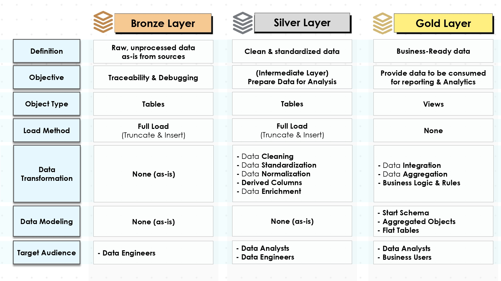
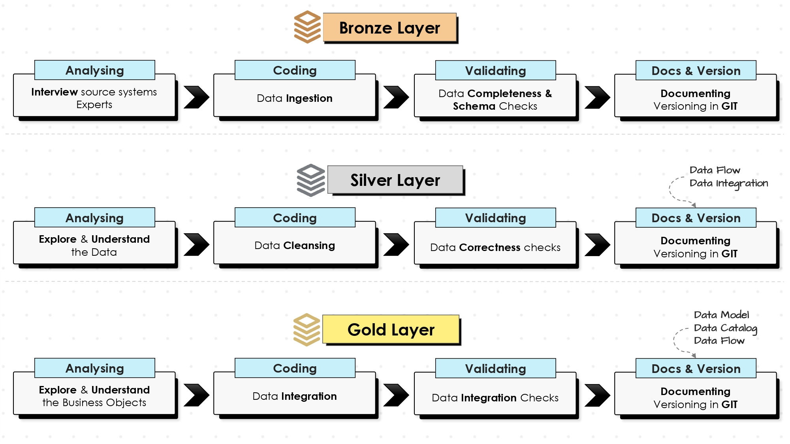

#  End-to-End Data Warehouse with DBT & Snowflake using Medallion Architecture  

This project is centered on designing a modern, scalable data pipeline that consolidates sales data from multiple sources. 

## 📑 Table of Contents  

1. [Project Overview](#-project-overview)  
2. [Inspiration](#-inspiration)  
3. [As-Is vs To-Be](#-as-is-vs-to-be)  
4. [Data Architecture](#-high-level-data-architecture--data-management-techniques-adopted)
   - [High-Level Design Architecture](#-high-level-data-architecture--data-management-techniques-adopted)
   - [Data Management Techniques](#-high-level-data-architecture--data-management-techniques-adopted)
5. [Data Transformation Layers](#️-data-transformation-layers)  
   - [Extraction](#️-data-transformation-layers)  
   - [Transformation](#️-data-transformation-layers)  
   - [Load](#️-data-transformation-layers)  
6. [Key Terminology](#-key-terminology)  
7. [Why DBT?](#️-why-dbt-over-raw-sql)  
8. [Project Setup](#️-project-setup)  
    - [Load Raw Data into S3](#1-load-raw-data-into-s3)
    - [Snowflake Data Warehouse Setup](#2-snowflake-data-warehouse-setup)
9. [Usage](#-usage)  
10. [Future Improvements](#-future-improvements)  
11. [Conclusion](#-conclusion)  

## 📌 Project Overview  
This project demonstrates how to design and implement a **modern, scalable data warehouse** by leveraging the **Medallion Architecture (Bronze, Silver, Gold layers)** with **Snowflake** as the data warehouse, **Amazon S3** as the data lake storage, and **DBT (Data Build Tool)** for transformation and orchestration.  

The solution follows an **ETL approach** that ingests raw data from **ERP** and **CRM sources**, stores it in an S3 bucket, and then pipelines it into **Snowflake** for transformation and reporting.  

By applying the **Medallion Architecture**, data flows through structured stages (Bronze → Silver → Gold), ensuring data quality, scalability, and analytical readiness.  

## 👉 **Inspiration:**  

This project was inspired by the YouTube content by *Data with Baraa* titled:  
[**“SQL Data Warehouse from Scratch | Full Hands-On Data Engineering Project.”**](https://youtu.be/9GVqKuTVANE)  

While the original project used raw SQL for data transformations, I decided to **recreate and enhance it using DBT** to take advantage of modern data engineering best practices.  

Unlike traditional raw SQL development, this project leverages **DBT** to manage transformations in a modular, reusable, and version-controlled way. 

## 🔍 As-Is vs To-Be  

### ❌ As-Is (Current Challenges)  
- Data pipelines are **heavily dependent on raw SQL scripts** that are hard to maintain.  
- Lack of **version control and collaboration** – SQL code is often scattered across scripts and environments.  
- **Data quality issues** due to limited testing and validation of transformations.  
- No clear **data lineage**, making it difficult to trace where numbers in reports come from.  
- Manual and repetitive ETL processes that are **time-consuming** and prone to human error.  

### ✅ To-Be (Future State with DBT + Snowflake + Medallion)  
- **DBT-based modular pipelines** ensure reusable, maintainable, and scalable transformations.  
- All transformations are **version-controlled in Git**, enabling team collaboration and CI/CD workflows.  
- **Built-in testing and documentation** in DBT ensures high-quality, trustworthy datasets.  
- **Data lineage visibility** through DBT docs makes debugging and governance easier.  
- **Medallion Architecture (Bronze → Silver → Gold)** standardizes data layers for raw, cleaned, and business-ready data.  
- Snowflake provides **scalability, performance, and security** for handling large datasets efficiently.  

## 📊 High Level Data Architecture & Data Management Techniques Adopted  

To ensure clean, reliable, and business-ready data, the following **data management techniques** were applied in this project:  

### 🔹 Extraction  
- Descriptions
    - Source files from ERP and CRM systems are ingested into an **Amazon S3 bucket**.  
    - Snowflake’s external stage reads the data directly from S3.  
- Methods
    - **Extraction Methods: Pull extraction** – Data is pulled directly from source systems into the pipeline at scheduled intervals.  
    - **Extract Type: Full extraction** – Each run retrieves the complete dataset rather than incremental changes, ensuring consistency with the source.  
    - **Techniques: File Parsing / S3** – Raw files (CSV/JSON/Parquet) from ERP and CRM sources are parsed and ingested into **Amazon S3** before loading into Snowflake.  

### 🔹 Transformation 
- Descriptions 
    The transformation layer ensures raw data is standardized, cleaned, and enriched for business use.  
    - DBT models apply **cleaning, deduplication, standardization, and aggregations**.  
    - Jinja templates, macros, and DBT testing ensure accuracy and maintainability. 
- Methods
    - **Data Enrichment & Integration** – Combine ERP and CRM data to provide a holistic view of sales activities.  
    - **Derived Columns** – Create additional fields (e.g., revenue = price × quantity) for analysis.  
    - **Data Normalization** – Apply consistent naming conventions, units, and formats across datasets.  
    - **Data Aggregation** – Summarize data at various levels (customer, region, product).  
    - **Business Rules & Logic** – Implement KPIs and domain-specific transformations.  

    - **Data Cleaning Techniques:**  
        - **Remove duplicates** – Eliminate redundant records to ensure accuracy.  
        - **Data filtering** – Keep only relevant and valid data points.  
        - **Handle missing values** – Apply strategies like imputation or null handling.  
        - **Guard against invalid values** – Detect and correct incorrect data entries.  
        - **Handle unwanted spaces** – Trim unnecessary whitespace in textual data.  
        - **Data type casting** – Convert values into appropriate data types (e.g., string → integer).  
        - **Outlier detection** – Identify unusual values that may distort analysis. 

### 🔹 Load 
- Descriptions:
    - Transformed data is loaded into Snowflake **Silver** and **Gold** schema tables for analytics.
- Methods: 
    - **Processing Type: Batch processing** – Data is processed in scheduled batches rather than real time.  
    - **Load Methods: Full Load (Drop, Create, Insert)** – Destination tables are recreated during each load cycle to reflect the latest state of the source.  
    - **Slowly Changing Dimensions (SCD): Type 1 (Overwrite)** – Updates overwrite existing records, ensuring only the latest values are stored.  

## 🏗️ Data Transformation Layers

This project is designed around the **Medallion Architecture**, which organizes data into multiple structured layers for clarity, quality, and scalability:  

- **Bronze Layer (Raw Ingestion):**  
  Raw data from ERP and CRM systems is loaded into Snowflake staging tables.  

- **Silver Layer (Cleaned & Enriched):**  
  Data is cleaned, validated, and standardized using DBT transformations.  

- **Gold Layer (Business Models):**  
  Business-friendly tables are created for reporting, dashboards, and analytics. 

The diagram below provides a more detailed view of the transformations applied at each stage of the architecture:  

## 📖 Key Terminology  

- **Data Warehouse:**  

    Data warehouse is defined by **Bill Inmon** (known as the "father of the data warehouse), as a subject-oriented, integrated, time-variant, non-volatile collection of data that supports management's decision-making process. 

    A centralized repository designed for querying and analysis. It consolidates data from multiple sources (ERP, CRM, etc.) into a single source of truth for reporting and analytics.  

- **ETL (Extract, Transform, Load):**  
  
    A process that extracts raw data from source systems, transforms it into a clean and usable format, and loads it into a target system (Snowflake).  

- **DBT (Data Build Tool):**  
  
    A transformation framework that allows data analysts and engineers to write modular SQL-based transformations, with features like testing, lineage tracking, and documentation.  

- **Medallion Architecture:**  

    A layered data design pattern (Bronze → Silver → Gold) that organizes data transformations for scalability, governance, and maintainability.  

- **Staging Area:**  
  A temporary storage space where raw data is first landed (e.g., in Snowflake Bronze schema) before further cleaning and transformation.  

- **Data Modeling:**  
  The process of designing tables, schemas, and relationships that represent business concepts in an analytics-friendly way.  

## ⚖️ Why DBT over Raw SQL?  
| Aspect | Raw SQL | DBT (Data Build Tool) |
|--------|---------|------------------------|
| **Code Organization** | SQL scripts are scattered, difficult to structure. | Modular, version-controlled models organized into folders. |
| **Reusability** | Logic often duplicated across multiple scripts. | Macros & Jinja templating enable reusable and parameterized SQL. |
| **Collaboration** | Harder to track changes across teams. | Git integration supports collaborative workflows. |
| **Testing & Validation** | Manual testing required. | Built-in testing framework ensures data quality. |
| **Documentation** | Lacks automated documentation. | Auto-generated docs from models, sources, and lineage. |
| **Lineage & Transparency** | Hard to track dependencies across tables. | Automatic lineage graph shows dependencies clearly. |
| **Deployment** | Manual execution of SQL files. | CI/CD ready; models can be deployed incrementally. |
| **Scalability** | Becomes harder to manage as complexity grows. | Scales with modular design and environment management. |

## ⚙️ Project Setup  

Follow these steps to set up and run the project locally: 

### 1. Load Raw Data into S3

- Login to AWS
- Upload your ERP and CRM CSV/JSON files into an S3 bucket.
- Ensure the files are accessible to Snowflake via an external stage.

### 2. Snowflake Data Warehouse Setup

The following script provisions the required Snowflake objects: [Init Database](./scripts/init_database.sql)

- Roles and users (for DBT transformations)
- Warehouse, database, and schemas (Bronze, Silver, Gold layers)
- Grants/permissions for the TRANSFORM role
- External stage for ingesting raw ERP/CRM data from S3
- Raw tables for Bronze layer ingestion
- Stored procedure to automate Bronze layer loading

`⚠️ Note: Replace placeholder values (<choose-a-username>, <your-s3-bucket-name>, <your-aws-key-ID>, <your-aws-secret-key>) with actual values.`

